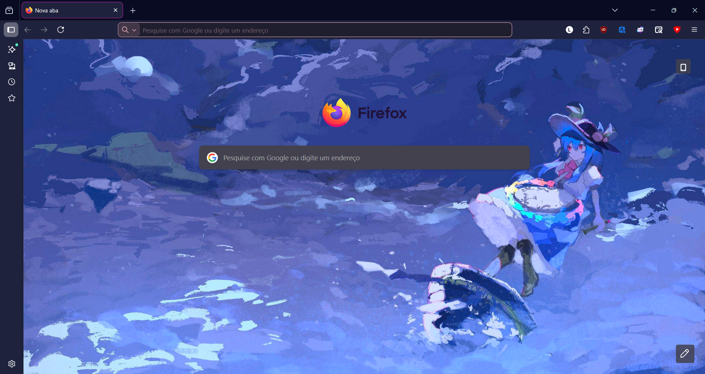
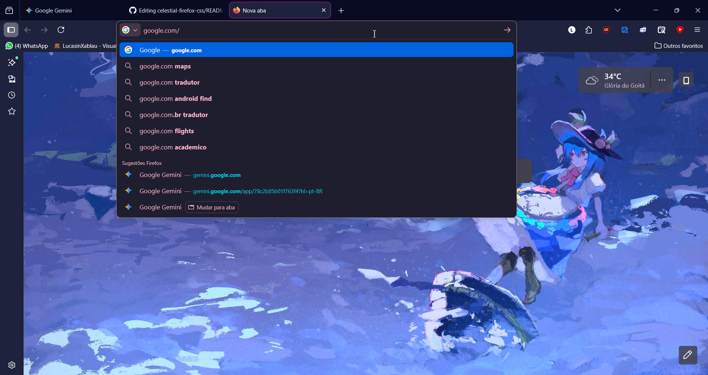

# Tenshi Fox CSS - celestial-firefox-css

**[🇺🇸 Read in English](README.md)**

Um "rice" (customização) minimalista para o Firefox, focado em um tema escuro com acentos em rosa neon, inspirado na estética da personagem Tenshi Hinanawi (Touhou Project).

O objetivo é limpar a interface, centralizar elementos e dar um toque "gamer/hacker" na barra de endereços sem perder a performance.

## 🎨 Screenshots

*(Substitua pelo print da sua home com o wallpaper)*

*(Substitua por um print da barra rosa em ação)*

## ✨ Funcionalidades

* **Barra de URL Customizada:** Fundo "dark mode" (roxo escuro) com texto e ícones em rosa neon vibrante.
* **Abas Centralizadas:** O texto das abas fica sempre no meio para um visual mais limpo.
* **Barra de Favoritos Automática:** A barra de favoritos fica oculta e só aparece quando você passa o mouse perto dela (ganho de espaço vertical).
* **Glow de Áudio:** Abas que estão tocando som ganham um brilho rosa neon em volta.
* **Visual Limpo:** Botão 'X' (fechar) oculto em abas inativas.

## 🚀 Como Instalar

Para usar este tema, você precisa habilitar a leitura de CSS externo no seu Firefox.

### Passo 1: Habilitar Customização
1.  Abra o Firefox e digite `about:config` na barra de endereços. Aceite o risco.
2.  Procure por `toolkit.legacyUserProfileCustomizations.stylesheets`.
3.  Mude o valor para **`true`** (clicando duas vezes ou no botão de alternar).

### Passo 2: Instalar o Arquivo
1.  No menu do Firefox, vá em **Ajuda** > **Mais informações para a resolução de problemas**.
2.  Na linha "Pasta do perfil", clique no botão **Abrir pasta**.
3.  Dentro da pasta que abriu, crie uma nova pasta chamada `chrome` (se não existir).
4.  Baixe o arquivo `userChrome.css` deste repositório e coloque dentro dessa pasta `chrome`.
5.  **Reinicie o Firefox.**

## ⚙️ Configurações Extras (Opcional)

* **Aceleração de Hardware:** Para garantir que as animações rodem lisas, certifique-se de que a aceleração de hardware está forçada no `about:config` (`layers.acceleration.force-enabled` setado para `true`).
* **Firefox Color:** Este CSS funciona bem sozinho, mas você pode usar a extensão Firefox Color para ajustar outros detalhes do tema se desejar.

---

## ⚖️ Legal & Licença

**Copyright © 2025 - shinylucasin**

📄 <b>Clique para ver o Resumo da Licença</b>

Este projeto está licenciado sob a **Licença MIT**.

Isso significa que você é livre para:
* ✅ Usar comercialmente
* ✅ Modificar
* ✅ Distribuir
* ✅ Usar de forma privada

Desde que você:
* 📝 Mantenha os direitos autorais e o aviso de licença originais.

O software é fornecido "como está", sem garantia de qualquer tipo.

[Ver arquivo LICENSE completo](LICENSE)

  <i>Criado com ❤️ e CSS por <a href="https://github.com/SeuUsuario">SeuUsuario</a></i>

